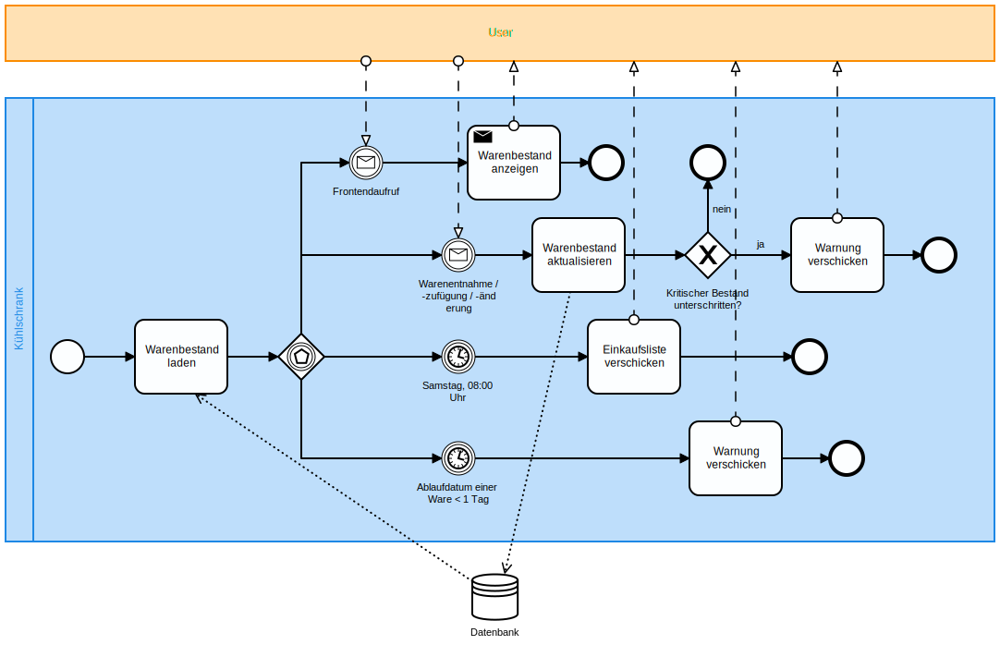

# Kühlschrank-Automatisierung mit Camunda

## Inhaltsverzeichnis

## Zielsetzung

Diese Applikation soll der einfachen Kontrolle eines Kühlschrankinhalts dienen:
Man kann neu gekaufte Lebensmittel hinzufügen, aufgebrauchte entfernen,
Änderungen vornehmen sowie den Bestand auslesen. Darüber hinaus wird an jedem
Samstagmorgen ein Mail mit der aktuellen Bestandsliste verschickt,
so dass man weiss, was man einkaufen muss. Ebenfalls wird einmal am Tag
überprüft, ob ein Lebensmittel bald das Ablaufdatum erreicht; dann wird
ebenfalls ein Mail verschickt.

## Prozessbeschreibung

Nach dem Starten des Prozesses werden die Daten (Liste mit Lebensmitteln)
aus einer Datei gelesen; anschliessend wird gewartet, bis entweder eine
Nachricht eintrifft oder ein Timer aktiv wird.

Nachrichten gibt es zweierlei: Einmal eine einfache für das Abfragen aller
Daten. Worauf ein UserTask für den Abschluss des Prozesses folgt. Dazwischen
(im Modell nicht sichtbar) findet ein API-Call für die Abfrage der
Prozessvariabeln statt. Der UserTask folgt dann, damit der Prozess nicht
vorzeitig beendet wird. Nach dem API-Call wird der UserTask ausgeführt und
der Prozess beendet.

Die Andere Nachricht betrifft eine Änderung in den Daten; dabei wird
innerhalb der Nachricht noch die Art (Hinzufügen, Löschen, Modifizieren)
und der Inhalt der Änderung mitgegeben. Die Daten werden durch ein Skript
bearbeitet, danach wird der Prozess beendet.

Auch Timer gibt es zweierlei: Jeden Samstag um 8:00 Uhr wird die Bestandsliste
per Mail verschickt, und jeden Tag findet eine Prüfung der Ablaufdaten statt;
hier wird die Liste derjenigen Lebensmittel verschickt, die in den nächsten zwei
Tagen ablaufen.

## Begriffsbeschreibungen

[//]: # "TODO: textliche Beschreibung der im Prozess vorkommenden Begriffe"

## Graphische Darstellung

